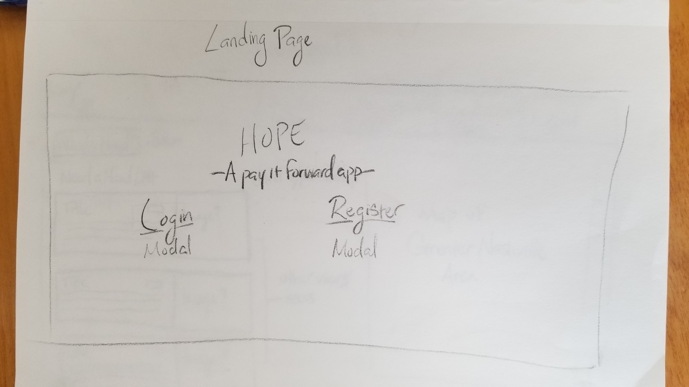
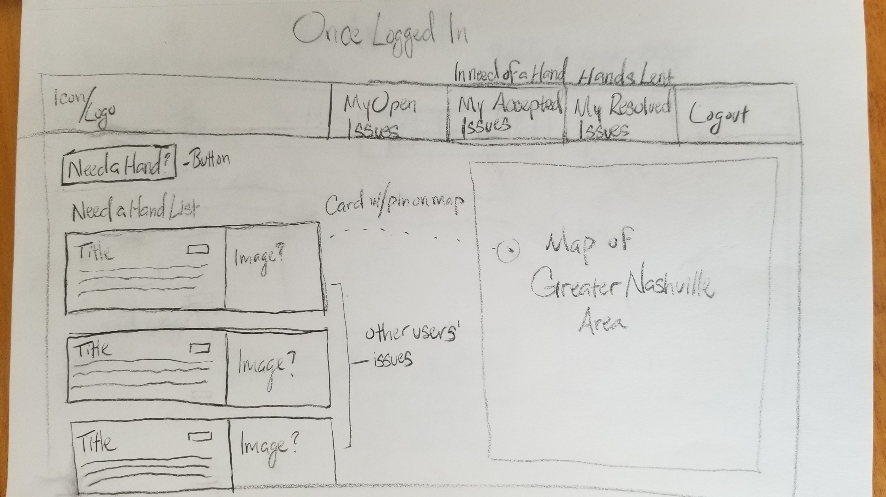
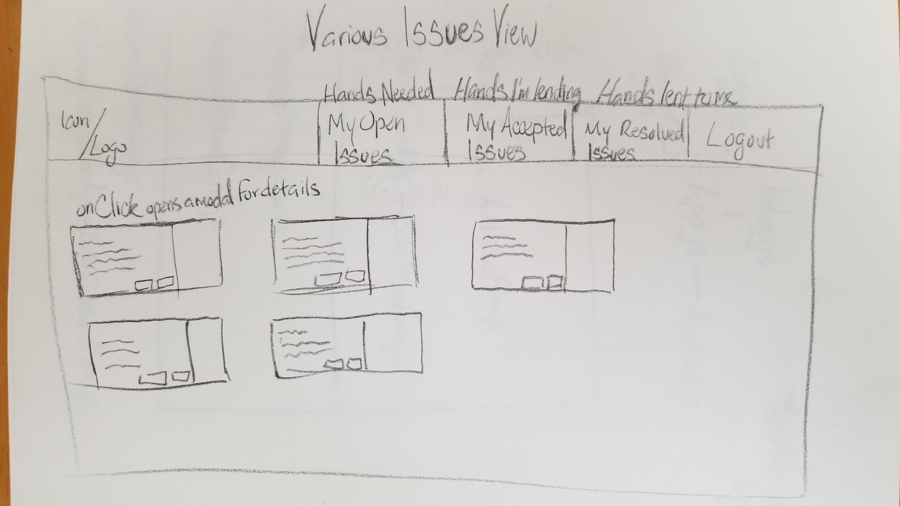
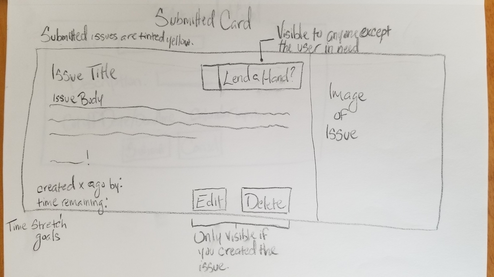
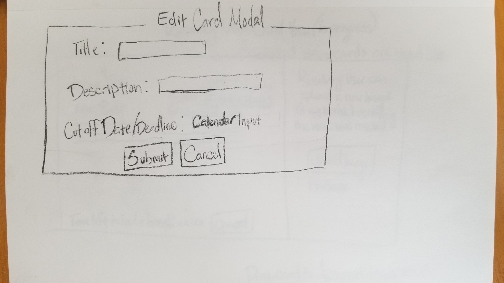
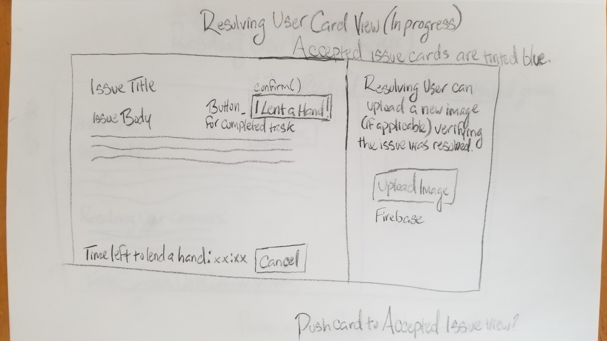
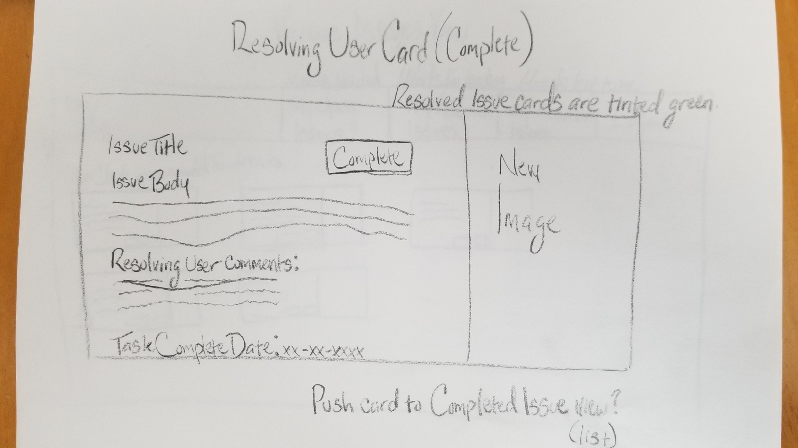

# Hope-Capstone-App

## Project Overview
In regards to current events over the past few years, an overarching sense of negativity has become prevalent in daily life. To me, this persistent stream of hardships, deception, corruption, etc. has, to an extent, left many feeling as if they had no voice. I wanted to design something that allowed people to interact in such a way that they might realize that, no matter how down things seem, you as an individual also have the ability to affect your immediate environment in a positive, meaningful way.

## Challenge Statement
How might we offer a platform that connects users in need with other local users willing to lend a hand, emphasizing the sense of community within the Greater Nashville Area?

## Personas

## Wireframes and Mockups

## User Testing
+ Received feedback for adding notifications and/or a status bar based on the stage the issue was in.

+ More robust method of communicating between the user in need of a hand and the user lending a hand.

+ Reconsider the order of the process of creating an issue.

## Lessons Learned